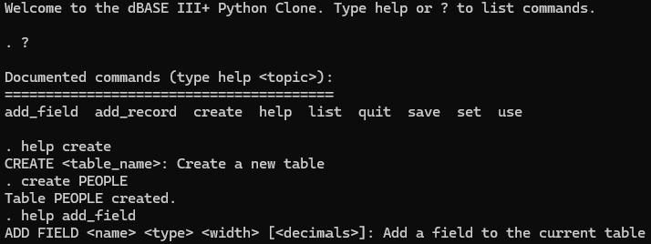

# dBASE III+ Python Clone



A lightweight Python implementation of a dBASE III+ compatible database system. This project provides a command-line interface for managing database tables in the style of the classic dBASE III+ software.

## Features

- Interactive command-line interface reminiscent of dBASE III+
- Create and manage database tables
- Define custom fields with various data types
- Add and list records with flexible display options
- Set relations between tables for relational data access
- Persistent storage with JSON-based state saving

## Installation

Clone this repository and run the Python script:

```bash
git clone https://github.com/yourusername/dbase-python-clone.git
cd dbase-python-clone
python dbase_interpreter.py
```

## Requirements

- Python 3.6+
- No external dependencies required

## Usage

### Basic Commands

Here are some of the core commands available in the interpreter:

- `CREATE <table_name>` - Create a new table
- `USE <table_name>` - Open a database table for use
- `ADD FIELD <name> <type> <width> [<decimals>]` - Add a field to the current table
- `ADD RECORD <value1> <value2> ...` - Add a record to the current table
- `LIST [options]` - List records in the current table
- `SET <option> <value>` - Configure various options
- `SAVE` - Save the current database state
- `QUIT` - Exit the program

### Example Session

```
Welcome to the dBASE III+ Python Clone. Type help or ? to list commands.

. CREATE CUSTOMERS
Table CUSTOMERS created.

. USE CUSTOMERS
Table CUSTOMERS is now in use.

. ADD FIELD ID C 10
Field ID added to table CUSTOMERS.

. ADD FIELD NAME C 30
Field NAME added to table CUSTOMERS.

. ADD FIELD BALANCE N 10 2
Field BALANCE added to table CUSTOMERS.

. ADD RECORD 1001 "John Smith" 250.50
Record added.

. ADD RECORD 1002 "Jane Doe" 175.25
Record added.

. SET RECORD ON
Record numbers are now ON

. LIST
Record#  ID         NAME                           BALANCE   
-------------------------------------------------------
      1  1001       John Smith                     250.50    
      2  1002       Jane Doe                       175.25    

. CREATE ORDERS
Table ORDERS created.

. USE ORDERS
Table ORDERS is now in use.

. ADD FIELD ORDER_ID C 10
Field ORDER_ID added to table ORDERS.

. ADD FIELD CUSTOMER_ID C 10
Field CUSTOMER_ID added to table ORDERS.

. ADD FIELD AMOUNT N 10 2
Field AMOUNT added to table ORDERS.

. ADD RECORD ORD001 1001 120.00
Record added.

. SET RELATION TO CUSTOMER_ID INTO CUSTOMERS
Relation set: ORDERS.CUSTOMER_ID -> CUSTOMERS

. LIST
Record#  ORDER_ID   CUSTOMER_ID AMOUNT     CUSTOMERS.ID CUSTOMERS.NAME                 CUSTOMERS.BALANCE
----------------------------------------------------------------------------------------------
      1  ORD001     1001        120.00     1001       John Smith                     250.50    

. SAVE
Database state saved.

. QUIT
Database state saved. Goodbye!
```

## Data Types

- `C` - Character (string)
- `N` - Numeric
- `L` - Logical (boolean)
- `D` - Date

## LIST Command Options

The LIST command supports several options:

- `LIST STRUCTURE` - Show the structure of the current table
- `LIST NEXT n` - List the next n records
- `LIST REST` - List all remaining records
- `LIST ALL` - List all records from the beginning
- `LIST FIELDS field1 field2 ...` - List only specific fields
- `LIST FOR condition` - List records that match a condition

## Relations

Set up relations between tables:

```
SET RELATION TO <field> INTO <table>
```

After setting a relation, the LIST command will automatically include fields from the related table.

## State Persistence

The database state is automatically saved when you quit and loaded when you start the program. You can also manually save the state using the `SAVE` command.

## Contributing

Contributions are welcome! Please feel free to submit a Pull Request.

## License

See LICENSE file. This project is licensed under the terms of Creative Commons Zero v1.0 Universal.

## Acknowledgements

This project is inspired by the original dBASE III+ software developed by Ashton-Tate in the 1980s.
